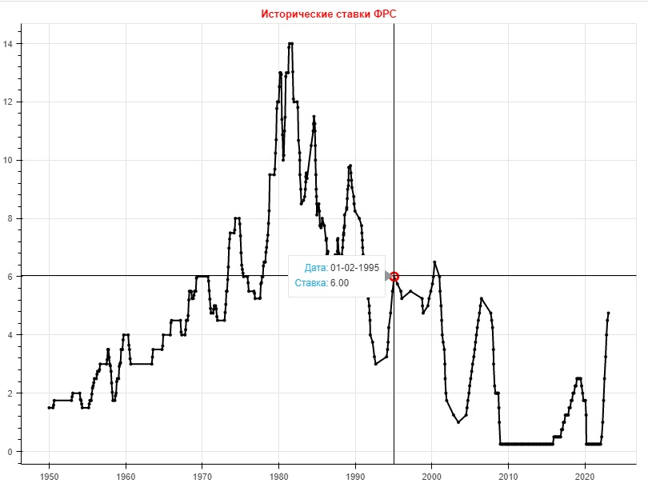

# Построение графика с помощью библиотеки Bokeh Python

Пробная реализация построения графика с использованием библиотеки Bokeh. Подробнее можно почитать на официальном сайте.

### Ссылка на официальный сайт:

:point_right: [Перейти на сайт](https://bokeh.org/ "Перейти")

---

### Пример моей реализации:

---
